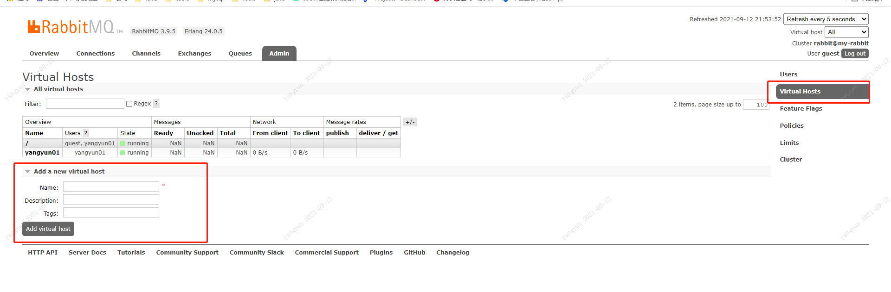

1. mq 概述
2. 应用场景
3. 为什么使用mq
   1. mq优势
   2. mq劣势
4. 常见mq产品
5. rabbitmq简介
6. rabbitmq 各组成部分
7. rabbitmq工作模式
   1. https://rabbitmq.com/getstarted.html
8. ​


Rabbit MQ

```
 # 查看版本 
 https://registry.hub.docker.com/_/rabbitmq
# docker 运行 rabbitmq
docker run -d --hostname my-rabbit --name yangyun01 -p 15672:15672 -p 5672:5672 rabbitmq:3-management
#  15672 为管理界面访问端口   5672 为应用访问的端口
dockers logs -f [容器名] 查看 docker 后天运行的mq的控制台日志
```

[Docker实践：RabbitMQ 的安装及配置](https://blog.csdn.net/u010647035/article/details/85541708?utm_term=dockerrabbitmq%E6%97%A5%E5%BF%97&utm_medium=distribute.pc_aggpage_search_result.none-task-blog-2~all~sobaiduweb~default-5-85541708&spm=3001.4430)

添加用户


添加虚拟机



添加新建虚拟机操作用户


